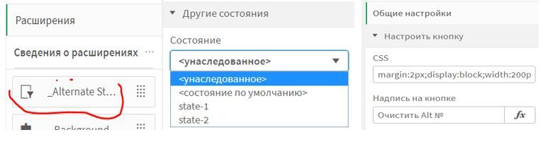

# Qlik-Sense-Clear-Alternate-State
...взял готовый скрипт с набором каких-то опций отсюда .
https://github.com/ChristofSchwarz/qs_ext_altStateActions

Оставил в итоге только "одну кнопку" ... сможете ей дать название, свойства css и присвоить Alternate state... Приложен архив с extention. Пробуйте.

